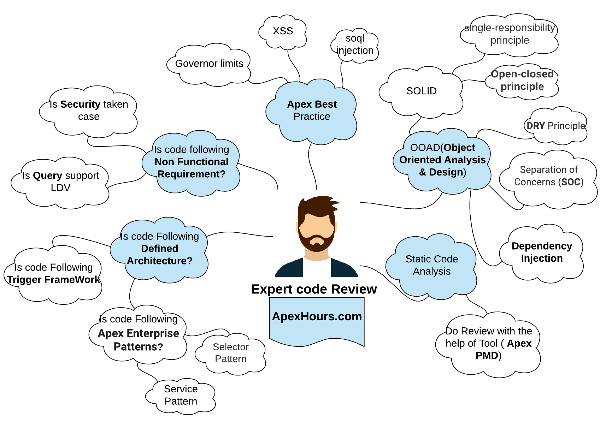

# Salesforce-Utils

<table>
  <tr>
    <td width="40%" align=center><br><br></b><p><b>Repository with tools, tricks, commands and resources for Salesforce development and administration.</p></td>
    <td>

## _Table of content_

- ⚙ [**LWC**](#lwc)
  - [LWC Debug](#lwc-debug)
- 💻 [**Command Issues**](#command-issues)
  - [Useful commands](#useful-commands)
    - [Retrieve metadata](#retrieve-metadata)
    - [Save logs beyond debugs logs](#save-logs-beyond-debugs-logs)
    - [Listar ORG](#listar-org)
    - [Create package in manifest folder](#create-package-in-manifest-folder)
    - [Mostrar alias y Value de las ORG](#mostrar-alias-y-value-de-las-org)
  - [No reconoce orgs](#no-reconoce-orgs)
  - [Scripts](#scripts)
    - [Execute Test in Package on deploy](#execute-test-in-package-on-deploy)
- [**Organization - Production - Sandbox**](#organization---production---sandbox)
  - [Standard - Custom Objects](#standard---custom-objects)
    - [Formula Fields](#formula-fields)
  - [ORG Doctor](#org-doctor)
  - [Grant Salesforce Support login access to your organization](#grant-salesforce-support-login-access-to-your-organization)
- [**Apex**](#apex)
  - [Code review checklist](#code-review-checklist)
  - [Postman](#postman)
  - [Alcanzar límite de queries](#alcanzar-límite-de-queries)
  - [Developer console doesn't show logs](#developer-console-doesnt-show-logs)
  - [Trigger Frameworks](#trigger-frameworks)
- 📚 [**SOQL**](#soql)
  - [Chain LIKE and NOT LIKE](#chain-like-and-not-like)
  - [Subquery examples](#subquery-examples)
  - [Search by KeyPrefix](#search-by-keyprefix)
- [**Naming Convention**](#naming-convention)
  - [List of common API suffixes in Salesforce](#list-of-common-API-suffixes-in-salesforce)   
- [**VS Code Tricks**](#vs-code)
  - [Package.xml](#packagexml)
  - [Tricks](#tricks)
  - [Unable to get issuer cert locally](#unable-to-get-issuer-cert-locally)
  - [My settings.json](#my-settingsjson)
- [References](#references)
    </td>
  </tr>

</table>

## LWC

- [Advanced Salesforce LWC debugging with Chrome Developer Tools](https://beyondthecloud.dev/blog/chrome-dev-tools-for-salesforce-lwc-developers)
- [Order of execution of wire in LWC](https://salesforce.stackexchange.com/questions/377190/order-of-execution-of-wire-in-lwc)

> [!TIP]
> Evita Visualforce Page. 😊

### LWC Debug

Pasos DEBUG LWC
1. Debug mode -> Seleccionar usuario y habilitar (Permite ver el JS direcamente en la consola del navegador, pudiendo podificar, debugear, etc)
2. Session settings -> Caching | Enable Secure persistent browser caching to improve performance:False (Permite que puedas refrescar sin que se te mantenga la Cache)
3. Session Settings -> Lightning Web Security | Use Lightning Web Security for Lightning web components and Aura components:False

## Command Issues

### Useful commands

#### Retrieve metadata

```shell
sfdx force:source:retrieve -m CustomObject:CustomObject__c
sfdx force:source:retrieve -m ApexClass:MyApexClass
sfdx force:source:retrieve -m Profile:Admin
```

#### Save logs beyond debugs logs

Enter this command in the VS Code terminal.

Leave it running while performing the desired actions.

Save file in root folder and put in the `log.txt` file all the logs that are produced.

```shell
sfdx force:apex:log:tail --color > log.txt
```

Also, you can retrieve apex log in VS Code: `Ctrl + Shif + P` Log: Retrieve Apex Log And Show Analysis.


#### List ORGs

```shell
sfdx force:org:list
sf org list
```

#### Show ORG alias and value

```shell
sfdx alias:list
```

#### Delete an org

```shell
sfdx force:org:delete -p -u 'YOUR_ORG_ALIAS_NAME'
```

#### Show ORG Description

```shell
sfdx force:org:display 
```

#### Unset Alias ORG

```shell
sfdx alias:unset YourAlias
```

#### Create package in manifest folder

```shell
sfdx force source manifest create --source-dir force-app/main/default --output-dir manifest --name=package
```

#### Retrieve from package.xml

```shell
sfdx project retrieve start -o <Nombre-Org> -x .\Package.xml
```

#### SalesforceTreeAPI

```shell
sfdx force:data:tree:import
```

### No reconoce ORGs

```shell
# Si no reconoce el valor de la ORG
sfdx force:org:list
sfdx alias:list

# Logout all orgs
sfdx alias:unset XXXX

# Volver a conectar
```

### Scripts

#### Execute Test in Package on deploy

```sh
# ------------------- Variable para especificar el nombre de la org según VS Code
DESTINATION="<nameORG>";

# ------------------- Especificar Package.xml, solo debe contener clases APEX y nomenclatura para Test.
# ------------------- Ej.: <nombreClase>_Test, <nombreClase>Test
FILE_PACKAGE="manifest/Package.xml";

#------------ Variable para montar el comando de ejecucion de clases especificas del Test
APEXTEST_LIST="";

while read line;
	do
		if [[ $line == *'Test'* ]];
		then
			line=${line/"<members>"/""};
			line=${line/"</members>"/","};
			if [[ $line != *'DataTestFactory'* ]];
			then
				APEXTEST_LIST="$APEXTEST_LIST$line";
			fi
		fi
	done < $FILE_PACKAGE
	
APEXTEST_LIST=${APEXTEST_LIST%,};

# ------------------- Imprimimos el comando lanzado en la terminal
echo "sfdx force:source:deploy -x "${FILE_PACKAGE}" -l RunSpecifiedTests -r "${APESXTEST_LIST}" -c -u "${DESTINATION}" --verbose";

# ------------------- Comando sfdx para validar clases Apex ejecutando Test Especificos
sfdx force:source:deploy -x ${FILE_PACKAGE} -l RunSpecifiedTests -r ${APESXTEST_LIST} -c -u ${DESTINATION} --verbose;
```

## Organization - Production - Sandbox

### Standard - Custom Objects

#### Formula Fields

Cuando se desee mostrar correctamente el label en vez de el APIName de una picklist, utilizar funcionalidades de las fórmulas. Ej.: Tengo una picklist que muestra los valores como: A-Suceso, B-EspacioBlanco-B12. Si se desea poner espacios entre los guiones, la fórmula debería ser así:

```soql
IF(
    CONTAINS(Text(RelatedObject__r.PicklistField__c), '-'),
    SUBSTITUTE(
        SUBSTITUTE(
            Text(RelatedObject__r.PicklistField__c),
            '-',
            ' - '
        ),
        '  -  ',
        ' - '
    ),
    Text(RelatedObject__r.PicklistField__c)
)
```

### ORG Doctor

To check org's status: [ORG Doctor](https://orgdoctor.herokuapp.com/)

### Grant Salesforce Support login access to your organization

1. In the upper right, click your image (avatar) and then click `Settings`.
2. In `Quick Find` search field, enter "Grant" and click `Grant Account Login Access`.
3. Set the `Access Duration` option to Salesforce.com Support. Note: It is recommended to set the `Access Duration` to one month for technical escalations. It can be extended later if needed. 
4. Click Save.

[Salesforce Help](https://help.salesforce.com/s/articleView?id=000384334&type=1)

## Apex

### Code review checklist



- [Code review checklist](https://www.apexhours.com/code-review-checklist/)
- [Clean code in Salesforce](https://www.apexhours.com/clean-code-in-salesforce/)

### Postman

Postman for Salesforce Developers.
[Postman Workspace](https://www.postman.com/salesforce-developers/workspace/salesforce-developers)

### Reach query limits

If you are going to reach the limit of queries per DML in loop:

  1. Set method -> last in the Trigger Handler.
  2. Control with next if and break process.
  3. Invoke error control framework if there is one.

```java

if (Limits.getQueries() < Limits.getLimitQueries() {
  insert sObjectList;
}
else {
  ErrorLog__c.insertError();
  break;
}
```

### Developer console doesn't show logs

When the 'Developer Console' does not show any log and freezes, this is what to do[^1]: if you have any Chromium based browser such as Chrome, edge, opera, etc. you have to open the dev tools from the console, open the network section and refresh and magically it is solved:
 
1. Login and open Developer Console by Chrome
2. Open Developer tools and select Network
3. Reload on Developer Console

### Trigger Frameworks
- Dan Appleman[^2] 
- Hari Krishnan[^3]
- Scot Wells[^4]
- O'Hara[^5]
- Mitch Spano[^6]

## SOQL

### Chain LIKE and NOT LIKE

```sql
# Forma de encadenar varios LIKE y NOT LIKE
SELECT Name
FROM Object
WHERE (NOT Name LIKE 'ST%')
  AND (NOT Name LIKE 'PA%')

# Bind 
SELECT Name FROM Object
WHERE (NOT Name LIKE 'ST%')
  AND (Name NOT IN :var)
```

### Subquery examples

```sql
SELECT Name 
FROM Account 
WHERE Id NOT IN 
  (
    SELECT AccountId 
    FROM Opportunity 
    WHERE IsClosed = true
  )
```

### Search by KeyPrefix

```sql
SELECT Id, DeveloperName
FROM EntityDefinition
WHERE KeyPrefix = 'XXX'
```

## Naming convention

### _Object Fields_

| **Field Type**             | **API Name**                 |
|----------------------------|------------------------------|
| Auto Number                | **AUT**_AutoNumberField__c   |
| Boolean                    | **FLG**_BooleanField__c      |
| Currency                   | **DIV**_CurrencyField__c     |
| Date & DateTime            | **DAT**_DateTimeField__c     |
| Email                      | **EMA**_EmailField__c        |
| Formula                    | **FOR**_FormulaField__c      |
| Geolocation                | **GEO**_GeolocationField__c  |
| Lookup                     | **LKP**_LookUpField__c       |
| Master-Detail Relationship | **MDR**_MasterDetailField__c |
| Multi-Select Picklist      | **MSE**_MultiSelectField__c  |
| Number                     | **NUM**_NumberField__c       |
| Percent                    | **PER**_PercentField__c      |
| Phone                      | **TEL**_PhoneField__c        |
| Picklist                   | **SEL**_PicklistField__c     |
| Roll-Up Summary            | **RUS**_RollUpSummaryField__c|
| Text                       | **TXT**_TextField__c         |
| Time                       | **HOR**_TimeField__c         |
| URL                        | **URL**_URLField__c          |

### _Metadata_

| **Metadata Type**         | **API Name**                 |
|---------------------------|------------------------------|
| Custom Label              | **LAB**_LabelName            |
| Custom Setting            | **CS**_CustomSettingName     |
| Event                     | **LEV**_EventName            |
| External Credential       | **EC**_ExtCredentialName     |
| Flow                      | **FLW**_FlowName             |
| Lightning Page            | **LP**_PageName              |
| List View                 | **LV**_ListViewName          |
| Named Credential          | **NC**_NamedCredentialName   |
| Path                      | **PTH**_PathName             |
| Tab                       | **TAB**_TabName              |
| Validation Rule           | **VR**_PathName              |
| Workflow                  | **WF**_ObjectNameProcess     |

### _Trigger and Classes_

| **Metadata Type**         | **API Name**                 |
|---------------------------|------------------------------|
| Trigger                   | **TRG**_TriggerName          |
| Trigger Handler           | **TRG**_ClassName**Handler** |
| Helper                    | **TRG**_ClassName**Helper**  |
| Batch                     | **BATCH**_ClassName          |
| Scheduler                 | **SCH**_ClassName            |
| Interface                 | **INT**_InterfaceName        |
| Test                      | ClassAPIName_**Test**        |
| Test Suite                | TestSuiteName_**TestSuite**  |

### _Visualforce_

| **Metadata Type**           | **API Name**                     |
|-----------------------------|----------------------------------|
| Visualforce Page            | **VFP**_PageName                 |
| Visualforce Controller      | **VFC**_ControllerName           |
| Visualforce Controller Test | ControllerAPIName_**Test**       |

### List of common API suffixes in Salesforce

| **API Suffixes**[^7]     | **Used for**                                        |  
|--------------------------|-----------------------------------------------------|
| **__c**                  | Object / Field                                      |          
| **__r**                  | Relationship                                        |      
| **__e**                  | Events                                              |  
| **__b**                  | Big Objects                                         |      
| **__mdt**	           | Custom Metadata Type                                |              
| **__x**	           | External Object                                     |          
| **__share**	           | Sharing Object                                      |          
| **__Tag**	           | Salesforce Tags                                     |          
| **__voteStat**	   | Rating for an article                               |              
| **__viewStat**	   | Number of view per article                          |                      
| **__kav**	           | Knowledge Article Objects                           |                  
| **__history**	           | Field History Tracking                              |                  
| **__xo**	           | Salesforce-to-Salesforce (S2S) spoke                |                              
| **__pc**	           | Custom Persona Account Field                        |                      
| **__ChangeEvent**	   | Change Data Capture                                 |              
| **__StateCode__s**	   | Custom Address field                                |              
| **__CountryCode__s**	   | Custom Address field                                |              
| **__Street__s**	   | Custom Address field                                |              
| **__PostalCode__s**	   | Custom Address field                                |              
| **__City__s**	           | Custom Address field                                |              
| **__GeocodeAccuracy__s** | Custom Address field                                |              
| **__dlm**	           | (Data Model Object) for the Customer Data Platform. |                                              
| **__chn**	           | Change Event channel                                |              
| **__latitude__s**	   | Latitude Coordinate                                 |              
| **__longitude__s**	   | Longitude Coordinate                                | 


## VS Code

### Package.xml

A `.xml` file to retrieve all metadata's type from Salesforce.

```xml
<Package xmlns="http://soap.sforce.com/2006/04/metadata">
  <types>
    <members>*</members>
    <name>ApexPage</name>
  </types>
  <types>
    <members>*</members>
    <name>ApexClass</name>
  </types>
  <types>
    <members>*</members>
    <name>Flow</name>
  </types>
  <types>
    <members>*</members>
    <name>CustomApplication</name>
  </types>
  <types>
    <members>*</members>
    <name>CustomMetadata</name>
  </types>
  <types>
    <members>*</members>
    <name>CustomObject</name>
  </types>
  <types>
    <members>*</members> //Asset.Status -> AssetStatus
    <name>StandardValueSet</name>
  </types> 
  <types>
    <members>*</members>
    <name>GlobalValueSet</name>
  </types>
  <types>
    <members>*</members>
    <name>CustomTab</name>
  </types>
  <types>
    <members>*</members>
    <name>FlexiPage</name>
  </types>
  <types>
    <members>*</members>
    <name>Layout</name>
  </types>
  <types>
    <members>*</members>
    <name>RecordType</name>
  </types>
  <types>
    <members>Admin</members>
    <name>Profile</name>
  </types>
  <version>60.0</version>
</Package>
```

### Tricks

> [!TIP]
> It is recommended to have the following line in your `settings.json` to detect conflicts before deploying to the ORG.
>
> ```json
> "salesforcedx-vscode-core.detectConflictsAtSync": true,
> ```

### Unable to get issuer cert locally

> [!CAUTION]
> Al hacer `sfdx force:org:list` aparece ese error.
>
> **Solution**: add this environment variable `NODE_TLS_REJECT_UNAUTHORIZED = 0`

### My settings.json

```json
{
    "[json]": {
        "editor.defaultFormatter": "vscode.json-language-features"
    },
    "[xml]": {
        "editor.defaultFormatter": "DotJoshJohnson.xml"
    },
    "apexPMD.runOnFileOpen": true,
    "better-comments.tags": [
        {
            "backgroundColor": "transparent",
            "bold": true,
            "color": "#FF2D00",
            "italic": false,
            "strikethrough": false,
            "tag": "!",
            "underline": true
        },
        {
            "backgroundColor": "transparent",
            "bold": true,
            "color": "#C848CE",
            "italic": false,
            "strikethrough": false,
            "tag": "-->",
            "underline": false
        },
        {
            "backgroundColor": "transparent",
            "bold": true,
            "color": "#3498DB",
            "italic": false,
            "strikethrough": false,
            "tag": "?",
            "underline": false
        },
        {
            "backgroundColor": "transparent",
            "bold": false,
            "color": "#474747",
            "italic": false,
            "strikethrough": true,
            "tag": "//",
            "underline": false
        },
        {
            "backgroundColor": "transparent",
            "bold": true,
            "color": "#FF8C00",
            "italic": false,
            "strikethrough": false,
            "tag": "todo",
            "underline": false
        },
        {
            "backgroundColor": "transparent",
            "bold": true,
            "color": "#98C379",
            "italic": false,
            "strikethrough": false,
            "tag": "*",
            "underline": false
        }
    ],
    "codesnap.showWindowControls": false,
    "codesnap.shutterAction": "copy",
    "codesnap.target": "window",
    "diffEditor.maxComputationTime": 0,
    "editor.bracketPairColorization.independentColorPoolPerBracketType": true,
    "editor.cursorBlinking": "expand",
    "editor.cursorSmoothCaretAnimation": "on",
    "editor.fontFamily": "JetBrains Mono, Victor Mono, Consolas, 'Courier New', monospace",
    "editor.fontLigatures": "'ss01', 'cv03', 'zero'",
    "editor.glyphMargin": false,
    "editor.guides.bracketPairs": true,
    "editor.indentSize": "tabSize",
    "editor.minimap.autohide": true,
    "editor.minimap.maxColumn": 60,
    "editor.occurrencesHighlight": "multiFile",
    "editor.overviewRulerBorder": false,
    "editor.scrollbar.verticalScrollbarSize": 8,
    "editor.stickyScroll.defaultModel": "indentationModel",
    "editor.stickyScroll.enabled": true,
    "editor.stickyScroll.maxLineCount": 10,
    "files.autoSave": "afterDelay",
    "git.confirmSync": false,
    "prettier.tabWidth": 4,
    "salesforcedx-vscode-apex.java.home": "",
    "salesforcedx-vscode-core.detectConflictsAtSync": true,
    "security.workspace.trust.untrustedFiles": "open",
    "settingsSync.ignoredExtensions": [],
    "symbols.hidesExplorerArrows": false,
    "terminal.integrated.stickyScroll.enabled": true,
    "window.zoomLevel": 1,
    "workbench.colorCustomizations": {
        "editor.lineHighlightBorder": "#ffffff1f"
    },
    "workbench.colorTheme": "Night Owl",
    "workbench.iconTheme": "material-icon-theme",
    "workbench.productIconTheme": "fluent-icons",
    "workbench.settings.applyToAllProfiles": [],
    "workbench.sideBar.location": "right",
    "workbench.tree.enableStickyScroll": true,
    "workbench.tree.stickyScrollMaxItemCount": 10,
    "xml.symbols.maxItemsComputed": -5000
}
```
---
##### References

[^1]: [Developer Console menus are unresponsive](https://help.salesforce.com/s/articleView?id=000386416&type=1)
[^2]: [Dan Appleman - Triggers without frameworks](https://github.com/danappleman/Triggers-without-frameworks)
[^3]: [Hari Krishnan](https://krishhari.wordpress.com/2013/07/22/an-architecture-framework-to-handle-triggers-in-the-force-com-platform/)
[^4]: [Scott Wells](https://github.com/salesforcedoc/tscottdev-trigger-framework/tree/master)
[^5]: [O'hara](https://github.com/kevinohara80/sfdc-trigger-framework)
[^6]: [Mitch Spano](https://github.com/mitchspano/apex-trigger-actions-framework)
[^7]: [Suffixes in Salesforce](https://www.apexhours.com/suffixes-in-salesforce/)

<!-- 
> [!NOTE]  
> Highlights information that users should take into account, even when skimming.

> [!TIP]
> Optional information to help a user be more successful.

> [!IMPORTANT]  
> Crucial information necessary for users to succeed.

> [!WARNING]  
> Critical content demanding immediate user attention due to potential risks.

> [!CAUTION]
> Negative potential consequences of an action.
-->
